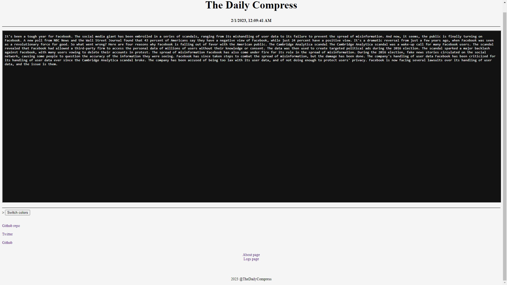

# The-Daily-Compress
An AI driven article writer that writes everyday about a randomly chosen topic and is posted to [thedailycompress.com](https://itzcozi.github.io/The-Daily-Compress/)




## Motivation
I made this website after watching a moist critical video on Chat-GPT writing an article and the result  
was very cool and after a couple of weeks waiting on Chat-GPT to release on openAI-API I decided to build the  
writer with GPT-3, after I was happy with the AI/script I thought to make a website to post all of the articles to.  
I dont recommend using any of these articles as trustworthy information and all articles should be fact  
checked before use in any other media.

Below is a graph representing how the daily article refresh happens.
```mermaid
  graph TD;
    AI-->Article;
    Workflow-->Deploy;
    Deploy-->Website;
    Website-->index.html;
    index.html-->article.txt;
  ```

## Topics
Please feel free to email me or make pull requests to share topic ideas. I listed some topics below.

```
Web 3 and blockchain technology
The fall of facebook
Games realeasing in unfinished states
Computer modern memory
Big O Complexity rendered unnecessary
Ponzi scheme cryptocurrency
The decline of the metaverse
Crypto Scams
The rise of AI
How animales are affected by global warming
Proprietary software and its effects on the world
Open source software
Half life 3 and why it will never come out
How VSCode effected the developers
Tiktok and misinformation
How music effects children at a young age
Rising mental health issues in children
Legalizing marijuana
The fall of object oriented programming
The disfunctional US education system
Parenting in the 21st century
Half-Life and how its affected the gaming industry
Lowering green gas emission
Why you should swap to linux
Reasons to stop using tiktok
Infulencer rug pulls
Moist critical and his impact on the gaming industry
```


## Development
This repository and website are both under development and anyone who would like to help is welcome to.
Since this AI and website are in development, it would be very helpful to report any bugs or problems with the issues
Tab and create a new issue with the tag low-priority; expect an answer within 24 hours.

[How to Contribute](.github/HOW-TO:Contribute.md)
[Website Source Code](https://github.com/itzCozi/The-Daily-Compress/tree/website)  
[Issue/Ticket Creation](https://github.com/itzCozi/The-Daily-Compress/blob/main/.github/HOW-TO:Create_Ticket.md)  
[Installation](https://github.com/itzCozi/The-Daily-Compress/blob/main/.github/HOW-TO:Install-Project.md)


### Code Rights
The following are a list of things you can and can not do with the source code provided in this repository.  
Also, if you intend to use or alter the source code you should first read [Installation](https://github.com/itzCozi/The-Daily-Compress/blob/main/.github/HOW-TO:Install-Project.md) guide and ensure you have  
filled all the requirements. And please read the files linked below and the branches section in this file. 

**You Can**: 
* Copy code snippets of 50+ lines 
* Run the program, Work on todo's 
* Debug, Edit and Refactor
* Fork this [repository](.github/HOW-TO:Contribute.md) or make a [pull request](.github/HOW-TO:Contribute.md)
* Submit a [issue](.github/HOW-TO:Create_Ticket.md) or [submit topics](https://github.com/itzCozi/The-Daily-Compress/issues/new?assignees=&labels=Priority%3A+medium%2C+Topic-submission&template=topic-submission.md&title=)
* Ask a [question](https://github.com/itzCozi/The-Daily-Compress/issues/new?assignees=&labels=Priority%3A+medium%2C+Topic-submission&template=question.md&title=) about the code

**You Can't**:
* Copy more than 50 lines of code
* Distribute the program without changing it
* Exploit bugs/glitches in the code
* Fail to notify original creators before a project launch 
* Distributing the program without giving credit

### Branches
An explaination of the branches and which one to contribute to.

**Main:** The main branch contains a version of the source code and lots of documentation in the .github folder.  
This branch is great for those who want to work on the AI and its functions, but its not the best if you are  
looking foreward to working on the website for that you need to head [here](https://github.com/itzCozi/The-Daily-Compress/tree/website). 

**Website:** The website branch is made souly for the purpoes of deploying code to the webpage and for updating  
the article using the AI. This branches code can be deployed to the website with github Actions this process can be  
automated so the website's article can automaticly refresh daily. 


## Contact me
discord: BadDevoleper#4200                                                                                                 
Email: Cooperransom08@outlook.com                                                                                          
[Replit](https://replit.com/@cozi08) | 
[Twitter](https://twitter.com/ransom_cooper)
